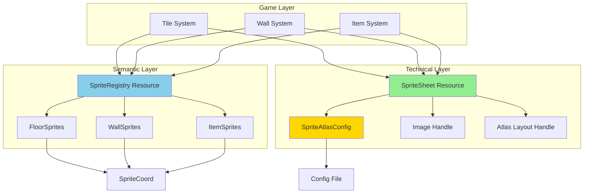

# Spritesheet System Refactoring Plan

## Executive Summary

This plan addresses architectural issues in the current spritesheet system while keeping complexity low for a project with limited sprite categories (floors, walls, items).

## Current Architecture Analysis

### Problems Identified

1. **Type Duplication**: [`SpriteKind`](../src/spritesheet/spritesheet.rs:77-81) vs [`FloorKind`](../src/tile/floor.rs:16-19)
2. **Hardcoded Values**: Grid dimensions (5x3) hardcoded in [`load_spritesheet()`](../src/spritesheet/spritesheet.rs:53-75)
3. **Manual Index Management**: Error-prone sprite index mapping
4. **Coupling**: Mixing technical sprite data with game entity categorization
5. **Non-Scalable Storage**: [`Floors`](../src/spritesheet/spritesheet.rs:5-17) inside [`SpriteSheet`](../src/spritesheet/spritesheet.rs:19-24)
6. **No Validation**: Missing bounds checking for sprite indices

## Proposed Architecture

### Design Philosophy

- **Separation of Concerns**: Technical sprite loading vs semantic sprite naming
- **Type Safety**: Use Rust's type system to prevent errors
- **Pragmatic Scalability**: Simple for 3-5 categories, not over-engineered
- **Coordinate-Based**: Use (row, col) instead of flat indices for clarity

### Architecture Diagram



## Proposed File Structure

```
src/spritesheet/
├── mod.rs
├── spritesheet.rs       # Core technical sprite loading
├── config.rs            # Atlas configuration
├── coord.rs             # Coordinate system for sprites
├── registry.rs          # Semantic sprite naming
└── categories/
    ├── mod.rs
    ├── floors.rs        # Floor sprite definitions
    ├── walls.rs         # Wall sprite definitions
    └── items.rs         # Item sprite definitions (future)
```

## Detailed Component Design

### 1. SpriteAtlasConfig

```rust
// src/spritesheet/config.rs
use bevy::prelude::*;
use serde::{Deserialize, Serialize};

#[derive(Serialize, Deserialize, Clone, Debug)]
pub struct SpriteAtlasConfig {
    pub path: String,
    pub columns: u32,
    pub rows: u32,
    pub padding: Option<UVec2>,
    pub offset: Option<UVec2>,
}

impl Default for SpriteAtlasConfig {
    fn default() -> Self {
        Self {
            path: "gfx/spritesheet24x24.png".to_string(),
            columns: 5,
            rows: 3,
            padding: None,
            offset: None,
        }
    }
}
```

**Benefits**:
- No hardcoded values
- Easy to modify without code changes
- Can be loaded from config file

### 2. SpriteCoord

```rust
// src/spritesheet/coord.rs
use bevy::prelude::*;

#[derive(Debug, Copy, Clone, PartialEq, Eq, Hash)]
pub struct SpriteCoord {
    pub row: u32,
    pub col: u32,
}

impl SpriteCoord {
    pub const fn new(row: u32, col: u32) -> Self {
        Self { row, col }
    }
    
    pub fn to_index(&self, columns: u32) -> usize {
        (self.row * columns + self.col) as usize
    }
    
    pub fn from_index(index: usize, columns: u32) -> Self {
        let index = index as u32;
        Self {
            row: index / columns,
            col: index % columns,
        }
    }
}

// Convenience constants
impl SpriteCoord {
    pub const FLOOR_DIRT: Self = Self::new(0, 0);
    pub const FLOOR_GRAVEL: Self = Self::new(0, 1);
    pub const WALL_STONE: Self = Self::new(1, 0);
    pub const WALL_BRICK: Self = Self::new(1, 1);
}
```

**Benefits**:
- Intuitive (row, col) matches visual spritesheet layout
- Easy to verify sprite locations
- Const functions allow compile-time definitions

### 3. Refactored SpriteSheet

```rust
// src/spritesheet/spritesheet.rs
use bevy::prelude::*;
use super::config::SpriteAtlasConfig;
use super::coord::SpriteCoord;

#[derive(Resource, Clone)]
pub struct SpriteSheet {
    handle_image: Handle<Image>,
    handle_atlas_layout: Handle<TextureAtlasLayout>,
    config: SpriteAtlasConfig,
}

impl SpriteSheet {
    pub fn get_sprite(&self, coord: SpriteCoord) -> Result<TextureAtlas, SpriteError> {
        // Bounds checking
        if coord.row >= self.config.rows || coord.col >= self.config.columns {
            return Err(SpriteError::OutOfBounds {
                coord,
                max_rows: self.config.rows,
                max_cols: self.config.columns,
            });
        }
        
        let index = coord.to_index(self.config.columns);
        
        Ok(TextureAtlas {
            layout: self.handle_atlas_layout.clone(),
            index,
        })
    }
    
    pub fn get_handle_image(&self) -> Handle<Image> {
        self.handle_image.clone()
    }
    
    pub fn get_texture_atlas_layout(&self) -> Handle<TextureAtlasLayout> {
        self.handle_atlas_layout.clone()
    }
}

#[derive(Debug, thiserror::Error)]
pub enum SpriteError {
    #[error("Sprite coordinate ({coord:?}) out of bounds (max: {max_rows}x{max_cols})")]
    OutOfBounds {
        coord: SpriteCoord,
        max_rows: u32,
        max_cols: u32,
    },
}
```

**Benefits**:
- Pure technical concern (no game logic)
- Bounds checking prevents runtime errors
- Clear error messages
- Stores atlas config for validation

### 4. Sprite Categories

```rust
// src/spritesheet/categories/floors.rs
use super::super::coord::SpriteCoord;

#[derive(Debug, Copy, Clone, PartialEq, Eq)]
pub enum FloorKind {
    Dirt,
    Gravel,
}

impl FloorKind {
    pub fn coord(&self) -> SpriteCoord {
        match self {
            FloorKind::Dirt => SpriteCoord::FLOOR_DIRT,
            FloorKind::Gravel => SpriteCoord::FLOOR_GRAVEL,
        }
    }
}

// src/spritesheet/categories/walls.rs
use super::super::coord::SpriteCoord;

#[derive(Debug, Copy, Clone, PartialEq, Eq)]
pub enum WallKind {
    Stone,
    Brick,
}

impl WallKind {
    pub fn coord(&self) -> SpriteCoord {
        match self {
            WallKind::Stone => SpriteCoord::WALL_STONE,
            WallKind::Brick => SpriteCoord::WALL_BRICK,
        }
    }
}
```

**Benefits**:
- Single source of truth for each category
- Type-safe enum for each category
- Easy to add new sprites within category
- No duplication between modules

### 5. Sprite Registry (Optional, for convenience)

```rust
// src/spritesheet/registry.rs
use bevy::prelude::*;
use super::categories::{FloorKind, WallKind};

#[derive(Resource, Default)]
pub struct SpriteRegistry {
    // Could store commonly used combinations or cached lookups
    // For a small system, this might be unnecessary
}

impl SpriteRegistry {
    pub fn floor_coord(kind: FloorKind) -> SpriteCoord {
        kind.coord()
    }
    
    pub fn wall_coord(kind: WallKind) -> SpriteCoord {
        kind.coord()
    }
}
```

## Updated Config Structure

```json
// assets/config/config.json
{
    "base_size": 24,
    "scale": 1,
    "sprite_atlas": {
        "path": "gfx/spritesheet24x24.png",
        "columns": 5,
        "rows": 3,
        "padding": null,
        "offset": null
    }
}
```

## Updated Usage Example

```rust
// src/tile/tile.rs (simplified example)
use crate::spritesheet::{SpriteSheet, categories::FloorKind};

fn spawn_tile(
    mut commands: Commands,
    config: Res<Config>,
    sprite_sheet: Res<SpriteSheet>,
) {
    let floor_kind = FloorKind::Dirt;
    let coord = floor_kind.coord();
    
    // With error handling
    let sprite = sprite_sheet
        .get_sprite(coord)
        .expect("Invalid sprite coordinate");
    
    commands.spawn((
        Tile::from_xy(0, 0),
        Sprite::from_atlas_image(
            sprite_sheet.get_handle_image(),
            sprite,
        ),
        // ... rest of components
    ));
}
```

## Migration Strategy

### Phase 1: Add New Components (Non-Breaking)
- Create new files: `config.rs`, `coord.rs`
- Add `SpriteAtlasConfig` and `SpriteCoord`
- Keep existing code functional

### Phase 2: Refactor Categories
- Move `FloorKind` to `categories/floors.rs`
- Remove duplicate `SpriteKind` enum
- Update imports in tile module

### Phase 3: Refactor SpriteSheet
- Update `SpriteSheet` to use new system
- Add bounds checking
- Update `load_spritesheet()` function

### Phase 4: Update Usage Sites
- Update `tile.rs` to use new API
- Test with existing functionality
- Verify sprites render correctly

### Phase 5: Cleanup
- Remove deprecated code
- Update documentation
- Add unit tests

## Benefits Summary

| Improvement | Before | After |
|-------------|--------|-------|
| **Type Safety** | Manual index numbers | Coordinate-based with validation |
| **Scalability** | Floors inside SpriteSheet | Separate category modules |
| **Configuration** | Hardcoded 5x3 | Config file driven |
| **Error Handling** | None | Bounds checking with errors |
| **Code Clarity** | Mixed concerns | Clear separation |
| **Maintenance** | Update multiple enums | Single source per category |

## Risks & Mitigations

### Risk: Breaking Changes
**Mitigation**: Implement in phases, maintain backward compatibility until migration complete

### Risk: Over-Engineering
**Mitigation**: Keep registry optional, focus on core improvements only

### Risk: Performance Impact
**Mitigation**: Coordinate conversion is compile-time or trivial math, bounds checking is debug-only

## Recommendations

### Must Have
1. ✅ Coordinate-based indexing (`SpriteCoord`)
2. ✅ Atlas configuration in config file
3. ✅ Unified category enums (remove duplication)
4. ✅ Bounds checking

### Nice to Have
5. 📋 Error types for better debugging
6. 📋 Registry pattern (if needed)
7. 📋 Unit tests for coordinate conversion

### Skip for Now
8. ❌ Animation support
9. ❌ Dynamic sprite loading
10. ❌ Multiple spritesheet support

## Next Steps

1. Review this plan and confirm approach
2. Switch to Code mode for implementation
3. Implement Phase 1 changes
4. Test and validate
5. Continue with remaining phases

## Questions?

- Should sprite atlas config be in main config.json or separate file?
- Do you want strict error handling (Result types) or expect/unwrap for simplicity?
- Any specific sprite organization in your PNG file I should know about?
