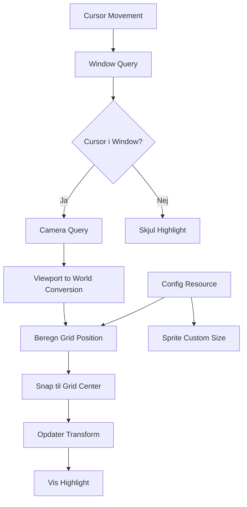

# Tile Highlight System Plan

## Oversigt
Implementer et tile highlight system der viser en transparent farvet overlay på den tile som musen hover over.

## Teknisk Beslutning: Transparent Rect vs Sprite

**Valg:** Brug Bevy's `Sprite` med `Color::srgba()` og `custom_size`

**Hvorfor:**
- ✅ Simpelt - kræver ingen assets
- ✅ Efficient - direkte GPU rendering
- ✅ Fleksibelt - nem at ændre farve og transparency
- ✅ Performance - ingen texture lookup nødvendigt

**Alternativ (ikke valgt):** Sprite fra atlas ville kræve ekstra asset og være unødvendig kompleksitet.

## Arkitektur



## Fil Struktur

### Ny fil: `src/uis/tile_highlight.rs`

```rust
use bevy::prelude::*;
use crate::codeunits::config::Config;

// Component der markerer highlight entity
#[derive(Component)]
pub struct TileHighlight;

// Plugin struct
pub struct TileHighlightPlugin;

impl Plugin for TileHighlightPlugin {
    fn build(&self, app: &mut App) {
        app
            .add_systems(Startup, spawn_tile_highlight)
            .add_systems(Update, update_tile_highlight);
    }
}

// Spawn highlight ved start
fn spawn_tile_highlight(
    mut commands: Commands,
    config: Res<Config>,
) {
    // Spawn transparent sprite
    commands.spawn((
        TileHighlight,
        Sprite {
            color: Color::srgba(1.0, 1.0, 0.0, 0.3), // Gul, 30% opacity
            custom_size: Some(Vec2::new(
                config.scaled_size(),
                config.scaled_size()
            )),
            ..default()
        },
        Transform::from_xyz(0.0, 0.0, 150.0), // z=150 (over floor og walls)
        Visibility::Hidden, // Start skjult
    ));
}

// Opdater highlight position baseret på mouse
fn update_tile_highlight(
    mut highlight_query: Query<(&mut Transform, &mut Visibility), With<TileHighlight>>,
    camera_query: Query<(&Camera, &GlobalTransform)>,
    window_query: Query<&Window>,
    config: Res<Config>,
) {
    let Ok((mut transform, mut visibility)) = highlight_query.single_mut() else {
        return;
    };
    
    let Ok(window) = window_query.single() else {
        return;
    };
    
    let Ok((camera, camera_transform)) = camera_query.single() else {
        return;
    };
    
    // Få cursor position
    let Some(cursor_pos) = window.cursor_position() else {
        *visibility = Visibility::Hidden;
        return;
    };
    
    // Konverter til world coordinates
    let Some(world_pos) = camera.viewport_to_world_2d(camera_transform, cursor_pos) else {
        *visibility = Visibility::Hidden;
        return;
    };
    
    // Beregn grid position
    let tile_size = config.scaled_size();
    let grid_x = (world_pos.x / tile_size).floor();
    let grid_y = (world_pos.y / tile_size).floor();
    
    // Snap til grid center
    let snap_x = grid_x * tile_size;
    let snap_y = grid_y * tile_size;
    
    // Opdater transform (behold z-position)
    transform.translation.x = snap_x;
    transform.translation.y = snap_y;
    
    // Vis highlight
    *visibility = Visibility::Visible;
}
```

## Grid Position Beregning

Dit grid system bruger:
- Positive X går mod højre
- Negative Y går nedad (se floor spawn)
- Tile size: `config.scaled_size()` (24 * scale)

**Floor tile centers er på:**
```
(0, 0), (scaled_size, 0), (2*scaled_size, 0)...
(0, -scaled_size), (scaled_size, -scaled_size)...
```

**Highlight skal snappe til samme positions:**
```rust
let grid_x = (world_pos.x / tile_size).floor();
let grid_y = (world_pos.y / tile_size).floor();
let snap_x = grid_x * tile_size;
let snap_y = grid_y * tile_size;
```

## Z-Ordering

Baseret på existing code:
- Floor tiles: z = 100
- Walls: (behøver check)
- **Highlight: z = 150** ✓

Dette sikrer highlight vises over alle tiles.

## Integration Steps

1. **Opret fil:** `src/uis/tile_highlight.rs`

2. **Opdater `src/uis/mod.rs`:**
```rust
pub mod sprite_kind;
pub mod sprite_sheet;
pub mod tile_highlight; // Ny linje

pub use tile_highlight::TileHighlightPlugin; // Ny linje
```

3. **Opdater `src/main.rs`:**
```rust
use uis::{
    sprite_sheet::SpriteSheetPlugin,
    tile_highlight::TileHighlightPlugin, // Ny linje
};

// I app.add_plugins:
.add_plugins((
    CameraPlugin, ConfigPlugin, InputPlugin,
    FloorPlugin, WallPlugin,
    SpriteSheetPlugin,
    TileHighlightPlugin, // Ny linje
))
```

## Fremtidige Forbedringer (Valgfrit)

1. **Forskellige farver baseret på tile type:**
```rust
if is_walkable(grid_x, grid_y) {
    sprite.color = Color::srgba(0.0, 1.0, 0.0, 0.3); // Grøn
} else {
    sprite.color = Color::srgba(1.0, 0.0, 0.0, 0.3); // Rød
}
```

2. **Pulse animation:**
```rust
let time_sin = (time.elapsed_secs() * 2.0).sin();
let alpha = 0.2 + (time_sin * 0.15);
sprite.color.set_alpha(alpha);
```

3. **Toggle on/off med keybind:**
```rust
if keyboard.just_pressed(KeyCode::KeyH) {
    highlight_enabled.toggle();
}
```

4. **Vise grid koordinater via Text2d:**
```rust
commands.spawn((
    Text2d::new(format!("({}, {})", grid_x, grid_y)),
    Transform::from_xyz(snap_x, snap_y, 151.0),
));
```

## Test Tjekliste

- [ ] Highlight vises når musen er over vinduet
- [ ] Highlight skjules når musen forlader vinduet
- [ ] Highlight snapper korrekt til grid
- [ ] Highlight følger musen smooth
- [ ] Highlight vises over alle andre tiles
- [ ] Highlight fungerer mens camera flytter sig
- [ ] Highlight størrelse matcher tile størrelse
- [ ] Transparency er synlig (kan se tiles under)

## Dependencies

Ingen nye dependencies nødvendigt - alt bruges fra Bevy core.
